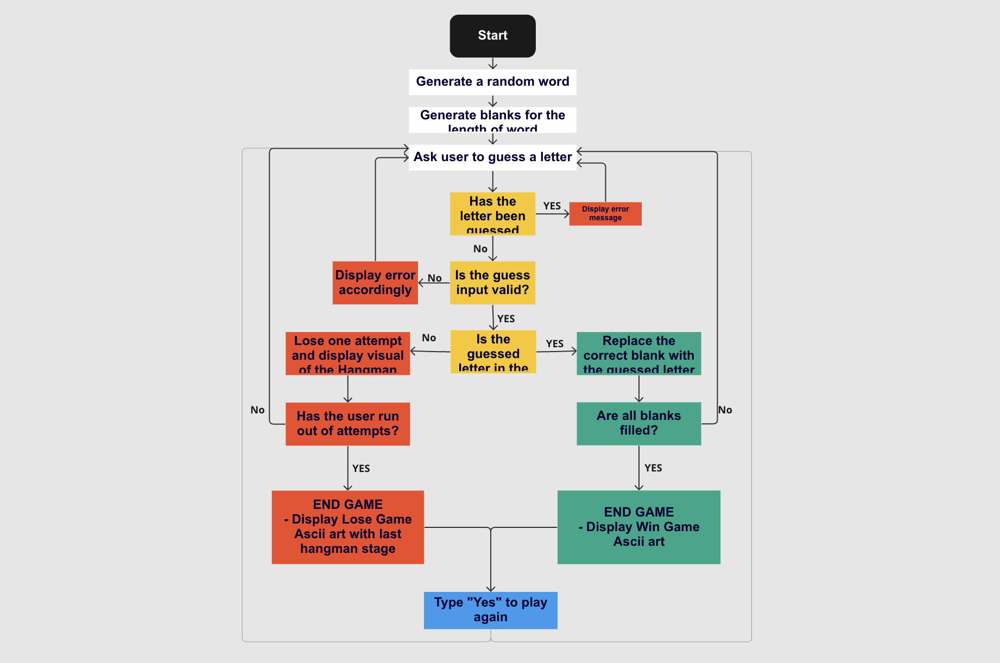

# Hangman Word Game - Portfolio project 3

Hangman is an interactive command line game that allows the player to play a game where you have to guess a word, letter by letter. You have 9 failed attempts before you lose!

You access the deployed game here: <a href="https://hangmanpp3.herokuapp.com/" target="_blank">Hangman Game Page</a>

# Contents
- [Project Aim](#project-aim)
- [User Experience](#user-experience)
    - [Site Aims](#site-aims)
    - [User Stories](#user-stories)
- [Flowchart](#flowchart)
- [Features](#features)
    - [Welcome Screen](#welcome-screen)
    - [Error Messages](#error-messages)
    - [Win/Lose, Play again?](#winlose-play-again)
    - [Play again](#play-again)
- [Technologies Used](#technologies-used)
- [Testing](#testing)
    - [PEP8 Validator Extensions](#pep8-validator-extension)
    - [Manual Testing](#manual-testing)
    - [Bug Fixes](#bug-fixes)
- [Terminal Compitability](#terminal-compatibality)
    - [Heroku Terminal](#heroku-terminal)
    - [Local Terminal](#local-terminal)
- [Deployment](#deployment)
    - [Deployment to Heroku](#deployment-to-heroku)
    - [Fork Repository to GitHub](#fork-repository-to-github)
    - [Clone Repository on GitHub](#clone-repository-on-github)
- [Credits](#credits)

# Project Aim

The aim of this project is to deliver a simple  command line application, which I have chosen to make as a game. The game is called 'Hangman' and is based around guessing a word by filling blanks that indicate how many letters the word contains.

The origin of the game is unknown but a variant is mentioned in Alice Gommes' book, released 1894 "Birds, Beasts, and Fishes". This version does not contain the hanged man illustration but presents the score of attempts it took for the player to fill in the blanks.

You can read more about the games background here: <a href="https://en.wikipedia.org/wiki/Hangman_(game)" target="_blank">Wikipedia -> Hangman (game)</a>

# User Experience

## Site Aims

* To provide a simple app the allows the user to play the word guessing game Hangman
* To provide an interactive experience through the game with color and instructions that are easy to understand
* To provide clear response to the user input

## User Stories

The user is any person who likes to play guessing games and wants a real challenge of the Hangman Game.

|  |  |  |   |
|-----------------|:-------------|:---------------:|:---------------:|
| 1 | User | As a user, I want to be able to play a word guessing game | So I can have some fun|
| 2 | User | As a user, I want to have a limited amount of attempts| So it's fun yet challenging |
| 3 | User | As a user, I want to be able to start the game when I am ready | So I can mentally prepare for the challenge |
| 4 | User | As a user, I want to be able to know how many attempts I have left before the game is lost | So I can plan my steps carefully|
| 5 | User | As a user, I want to have an error that tells me if the input I guess is wrong, already guess or not valid | So I can focus on the game and don't have to worry about unnecessary thinking|
| 6 | User | As a user, I want to be able to start a new game when the current one ends | So I can try the challenge again|
| 7 | User | As a user, I want a clear visual response when the game ends, either win or lose | So I clearely understand when the game is over|

## Flowchart

The flowchart is created with the online web page tool <a href="https://miro.com/">'miro'.</a>

# Features

## Welcome Screen
The introductory feature contains a welcome message, the game rules and an ascii art hangman logo.

The game starts upon loading and the random word is already generated for the user to guess their first letter when they are ready.

## Error Messages

There are four error messages that can display if the users input is not valid. See all three on the screenshot below:

## Win/Lose, Play again?

When the game comes to an end, depending on if it's a win or a lose. The following ascii arts will be displayed. Below the user can choose to restart the game by typing 'yes'.

## Play again

If the user choses to type 'yes' and play again, the following screen and ascii art will be displayed. The game starts as soon as the player guesses a new letter.

# Technologies Used
* <a href="https://en.wikipedia.org/wiki/HTML5">HTML5</a> - to provide structure to the program/game
* <a href="https://en.wikipedia.org/wiki/CSS">CSS3</a> - to add styling to the program/game
* <a href="https://www.python.org/">Python</a> - to build functionality to the program/game
* <a href="https://developer.chrome.com/docs/devtools/">Google Chrome DevTools</a> - Debugging
* <a href="https://miro.com/">Miro</a> - To create a flow chart
* <a href="https://www.gitpod.io/">Gitpod</a> - Used to create, edit and write the code for the program
* <a href="https://dashboard.heroku.com/">Heroku</a> - Used to deploy the page

# Testing
## PEP8 Validator Extension
Running the pep8 validator extension within gitpod showed a number of errors and warnings. Among these where syntax errors such as 2 blank lines after classes, function etc. Furthermore to long lines have been shortened and class names have been changed to camelcased, starting with a capital letter. 

## Manual Testing
Manual testing has been carried out for testing that the error messages get triggered when they are supposed to, that functions work as intended and that the different ascii art screens display accordingly. 

All stages of the hangman work and only get displayed when a guess is a valid guess and has not been already guessed. See the different ascii versions below on the image:

Read & see more about the testing of the other animations under the [Features](#features) section.

## Bug Fixes

## Terminal Compatibality
This hangman game is to be used and deployed via Heroku, and the terminal template provided by Code Institute.
### Heroku Terminal:

### Local Terminal:

# Deployment

## Deployment to Heroku

* Create a Heroku account and login
* Click 'New' from the dashboard, underneath the header in the top right corner
* Click 'Create new app' option
* Enter your unique application name, select your region and then click 'Create App'
* Now on the project page, click the 'Settings' tab and scroll down to Config Vars.
* In the KEY input field, enter 'CREDS' and in the VALUE input field, enter the content of you creds.json file in your repository
* Click the 'Add' button to the right to add the Convig Vars
* On the same page scroll down to the buildpacks section and click 'Add Buildpack'
* Add both the Python and node.js buildpacks, making sure Python is above node.js
* Go back to the 'Deploy' tab
* Select Github deployment method
* Search for your repository and click the 'Connect' to link Heroku to your repository
* Select your preferred deplyment type; Automatic Deployment or Manual Deployment

## Fork Repository to GitHub
Forking the GitHub account creates a copy of the Repository. Changes can be made on this copy without affecting the original.

1. Log in to GitHub and locate the desired repository
2. Click the Fork button in the top corner, inline with the repository name.

## Clone Repository on GitHub

1. Click the code button underneath the main tab
2. In the 'Clone with HTTPS' section, click the clipboard icon to copy the URL.
3. Open Git Bash in your IDE of choice.
4. Change the current working directory to where you want the cloned directory to be made.
5. Type git clone, and then paste the URL copied from GitHub.
6. Press enter and the clone of your repository will be created.

# Credits